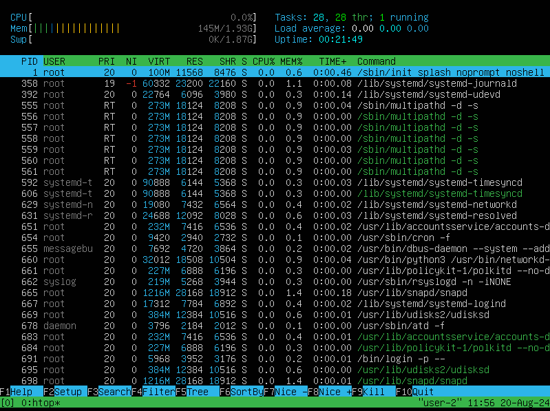
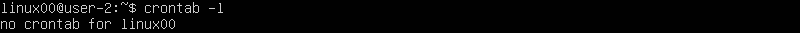

## Part 1. Установка ОС

### Установка `Ubuntu 20.04 Server LTS` без графического интерфейса.

- Узнать версию Ubuntu, выполнив команду  `cat /etc/issue`

## Part 2. Создание пользователя

### Создать пользователя, отличного от созданного при установке и переместить в группу adm. 

- Командой `sudo adduser linux02` создаем нового пользователя.

- Командой `sudo usermod -aG adm linux02` перемещаем пользователя в группу adm.

- Командой `groups linux02` проверяем.

    

- Новый пользователь в выводе команды `cat /etc/passwd`

    

## Part 3. Настройка сети ОС

    Сетевой интерфейс — это точка подключения двух частей сетевого оборудования или уровней протокола. Как правило, это представлено физической сетевой картой (NIC) для подключения между компьютером и частной или общедоступной сетью. 

### Задать название машины вида `user-1`.

### Установи временную зону, соответствующую твоему текущему местоположению.

### Выведи названия сетевых интерфейсов с помощью консольной команды.

    Один из самых основных виртуальных интерфейсов - `lo`. Это локальный сетевой интерфейс, который всегда указывает на текущий компьютер и позволяет программам обращаться к этому компьютеру.

### Используя консольную команду, получи ip адрес устройства, на котором ты работаешь, от DHCP-сервера.

    DHCP, --Dynamic Host Configuration Protocol - протокол динамической настройки узла — сетевой протокол, позволяющий сетевым устройствам автоматически получать IP-адрес и другие параметры, необходимые для работы в сети TCP/IP.

### Определи и выведи на экран внешний ip-адрес шлюза (ip) и внутренний IP-адрес шлюза, он же ip-адрес по умолчанию (gw).

### Задай статичные (заданные вручную, а не полученные от DHCP-сервера) настройки ip, gw, dns (используй публичный DNS-серверы, например 1.1.1.1 или 8.8.8.8).

### Перезагрузи виртуальную машину. Убедись, что статичные сетевые настройки (ip, gw, dns) соответствуют заданным в предыдущем пункте.

### Успешно пропингуй удаленные хосты 1.1.1.1 и ya.ru и вставь в отчёт скрин с выводом команды. В выводе команды должна быть фраза «0% packet loss».

## Part 4. Обновление ОС

### Обнови системные пакеты до последней на момент выполнения задания версии.

- После обновления системных пакетов, если ввести команду обновления повторно, должно появиться сообщение о том, что обновления отсутствуют.

## Part 5. Использование команды sudo

    Sudo (англ. Substitute User and do, дословно «подменить пользователя и выполнить») — программа для системного администрирования UNIX-систем, позволяющая делегировать те или иные привилегированные ресурсы пользователям с ведением протокола работы. Основная идея — дать пользователям как можно меньше прав, при этом достаточных для решения поставленных задач.

### Разреши пользователю, созданному в Part 2,выполнять команду sudo.

## Part 6. Установка и настройка службы времени 

### Настрой службу автоматической синхронизации времени.

- Выведи время часового пояса, в котором ты сейчас находишься.

## Part 7. Установка и использование текстовых редакторов

### Установи текстовые редакторы VIM (+ любые два по желанию NANO, MCEDIT, JOE и т. д.)

### Используя каждый из трех выбранных редакторов, создай файл test_X.txt, где X — название редактора, в котором создан файл. Напиши в нём свой никнейм, закрой файл с сохранением изменений.

    Vim

- Нажал `Esc`, затем ввел `:wq` и нажал `Enter`.

    Nano

- Нажал `Ctrl+O`, чтобы сохранить изменения, затем `Enter` для подтверждения имени файла. Нажал `Ctrl+X`, чтобы выйти.

    Joe

- Нажал `Ctrl+K`, затем `Ctrl+X` для сохранения и выхода.

### Используя каждый из трех выбранных редакторов, открой файл на редактирование, отредактируй файл, заменив никнейм на строку «21 School 21», закрой файл без сохранения изменений.

    Vim

- Нажал `Esc`, затем ввел `:wq` и нажал `Enter`.

    Nano

- Нажал `Ctrl+x`, чтобы сохранить изменения нажал `Y`. Нажал `Enter` чтобы подтвердить имя файла.

    Joe

- Нажал `Ctrl+K`, затем `Ctrl+X` для сохранения и выхода.

### Используя каждый из трех выбранных редакторов, отредактируй файл ещё раз (по аналогии с предыдущим пунктом), а затем освой функции поиска по содержимому файла (слово) и замены слова на любое другое.

- Результаты с поиском слова.
    Vim

    Nano

    Joe

- Результаты с командами, введёнными для замены слова на другое.

    Vim

    Nano

    Joe

## Part 8. Установка и базовая настройка сервиса SSHD

### Установи службу SSHd.

### Добавь автостарт службы при загрузке системы.

### Перенастрой службу SSHd на порт 2022.

### Используя команду ps, покажи наличие процесса sshd. Для этого к команде нужно подобрать ключи.

- ps: Команда для отображения информации о текущих процессах.
- a: Показывает процессы всех пользователей, а не только процессы текущего пользователя.
- u: Показывает процессы с дополнительными подробностями, такими как владелец процесса, время запуска и используемые ресурсы.
- x: Показывает процессы, которые не связаны с терминалом (например, демоны, запущенные при старте системы).
- | grep sshd: grep используется для фильтрации вывода, чтобы показать только строки, содержащие "sshd".

### Перезагрузи систему.

- Для перезагрузки ввел команду `sudo reboot`.

### Вывод команды netstat -tan

    Netstat (network statistics) — утилита командной строки, выводящая на дисплей состояние TCP-соединений (как входящих, так и исходящих), таблицы маршрутизации, число сетевых интерфейсов и сетевую статистику по протоколам. Доступна в операционных системах семейства UNIX и Windows. Основное назначение утилиты — поиск сетевых проблем и определение производительности сети.

    -t - Отображение текущего подключения в состоянии переноса нагрузки с процессора на сетевой адаптер при передаче данных ( "offload" );

    -a - Отображение всех подключений и ожидающих портов;

    -n - Отображение адресов и номеров портов в числовом формате. Вывод активных подключений TCP с отображением адресов и номеров портов в числовом формате без попыток определения имен;

    - 0.0.0.0 в foreign address означает что никто не подключен.

    - 0.0.0.0 в local address означает listening on all interfaces.

    - Если в качестве адреса отображается 0.0.0.0 , то это означает - "любой адрес", т.е в соединении могут использоваться все IP-адреса существующие на данном компьютере.

## Part 9. Установка и использование утилит top, htop

### Установи и запусти утилиты top и htop.

- По выводу команды top определи и напиши в отчёте:

    UPTIME: 9 min
    Количество авторизованных пользователей: 2
    Средняя загрузка системы: 0.0,  0.0, 0.0
    Общее количество процессов: 98
    Загрузка CPU: 0,3 us, 0.3 sy, 0.0 ni, 99,3 id, 0.0 wa, 0.0 hi, 0.0 si, 0.0 st
    Загрузка памяти: 1971.6 total, 1231.6 free, 144.6 used, 595.4 buuf/cache
    PID процесса, занимающего больше всего памяти: snapd
    PID процесса, занимающего больше всего процессорного времени: snapd

- Выводы команды htop по:

    PID

    PERCENT_CPU

    PERCENT_MEM

    TIME

    отфильтрованному для процесса sshd

    с процессом syslog, найденным, используя поиск

    С добавленным выводом hostname, clock и uptime

## Part 10. Использование утилиты fdisk

### Запусти команду fdisk -l.

    Название жесткого диска: dev/sda
    Размер: 20 GiB
    Количество секторов: 41943040
    Размер swap: 1007.5 K

## Part 11. Использование утилиты df

### Запусти команду df.

    Размер раздела: 10218772 
    Размер занятого пространства: 4764560
    Размер свободного пространства: 4913540
    Процент использования: 50%
    Еденица измерения: Килобайты

### Запусти команду df -Th.

    Размер раздела: 9.8G 
    Размер занятого пространства: 4.6G
    Размер свободного пространства: 4.7G
    Процент использования: 50%
    Тип файловой системы: ext4

## Part 12. Использование утилиты du

### Запусти команду du. Выведи размер папок /home, /var, /var/log (в байтах, в человекочитаемом виде).

### Выведи размер всего содержимого в /var/log (не общее, а каждого вложенного элемента, используя *).

## Part 13. Установка и использование утилиты ncdu

### Установи утилиту ncdu. Выведи размер папок /home, /var, /var/log.

    /home

    /var

    var/log

## Part 14. Работа с системными журналами

### Открой для просмотра:

    1. /var/log/dmesg

    2. /var/log/syslog

    3. /var/log/auth.log
    

    Время последней успешной авторизации: 
    Имя пользователя: linux02
    Метод входа в систему: password

### Перезапусти службу SSHd.

- Вставь в отчёт скрин с сообщением о рестарте службы (искать в логах).

## Part 15. Использование планировщика заданий CRON

### Используя планировщик заданий, запусти команду uptime через каждые 2 минуты.

- Результаты в журнале о выполнение.

- Список текущих задач для CRON.

### Удали все задания из планировщика заданий.

